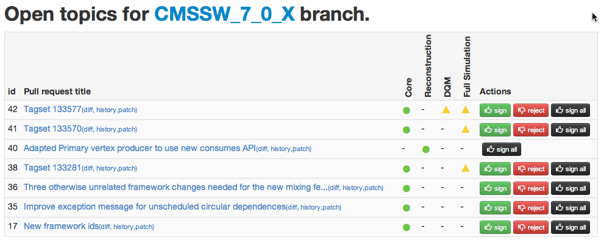

## Tutorial: approval process

This tutorial wil guide you through the topic approval procedures, i.e. the common 
L2 coordinator workflow.

### Before you start.

Please make sure you registered to GitHub and that you have provided them
a ssh public key to access your private repository. For more information see
the [FAQ](faq.html).

### Go to the Topic Collector to find out pending topics.

The *CMS Topic Collector* is the replacement of the old CVS Tag Collector. It 
contains a list of all the open topics for a given release.

You can get it by either going to:

https://cern.ch/cmsgit/cmsgit

or simply by clicking on the "Topic Collector" link at the top of this page.

You'll be prompted with the usual CERN login window, enter there your NICE
username and password, or use your certificate to login.

You'll be presented with a navigation bar showing all the available, open release
series:

### The open topics table.

As stated on the page, the table below the navigation bar refers to the topics
open for the selected release. For example:

The table is dived in three parts.

* The topic information, i.e. the left part of the table
* The approval process status, i.e. the green, yellow and red icons.
* The available actions, the buttons in the right part of the table.

### Checking a topic

In order to approve or reject a given topic, you need first to test it works as
expected. After you have created a local workarea:

    > scram project CMSSW_7_0_0_pre0
    > cd CMSSW_7_0_0_pre0/src
    > cmsenv

you can merge the topic in it by doing:

    git cms-merge-topic <topic-id>

where `<topic-id>` is the number shown in the left-most column, named "Id".

You then need to run the `checkdeps` equivalent via:

    git cms-checkdeps -a

this will checkout all the packages which are dependent on the changes you just
merged. You can finally recompile and test the topic:

    scram b -j 20
    runTheMatrix.py -s
    <test-at-will>

at minimum you should check that the short matrix actually works.

Notice you can specify `git-cms-merge-topic` as many times as you want, however
one big difference with CVS is that there is no need of dependency tracking,
git branches, which are the backend of a topic, already include the full set of
additions a developer had in his area, therefore each topic is self contained.
If something does not compile, it really means that the developer submitted
something which is not what he tested.

### Signing a topic

Once you are done with your tests, you can sign or reject a topic by going back
to the topic collector and clicking on the "Sign" or "Reject" button.

Notice that when you reject a topic, it will have a red circle next to it, but
it will not disappear from your sight. It will be up to the release manager to
close it or up to the developer to update it's changes and correct it.

### Commenting on topics

You can comment on topics, by clicking on their title in the table and adding a
comment in the standard GitHub GUI.

### Similarities with the old CVS workflow

Assuming you are familiar with the old, CVS based, workflow, nothing is
particularly different if you do the equation

`Tagset == Topic`

### Pull requests

Topics are nothing else than glorified [GitHub Pull
Requests](https://help.github.com/articles/using-pull-requests) the only
CMS-specific addition is that they have CMS specific approval information
attached to it.

[topic-collector]: https://cern.ch/cmsgit/cmsgit
